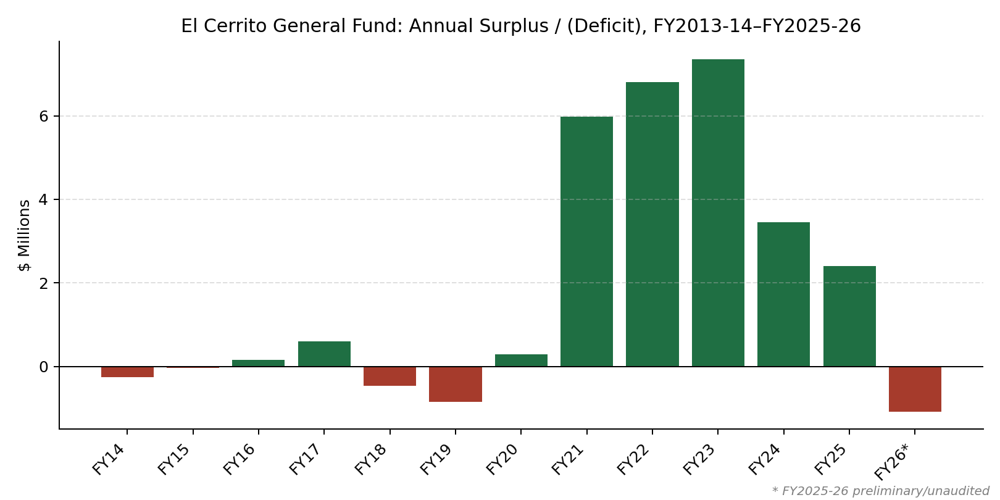
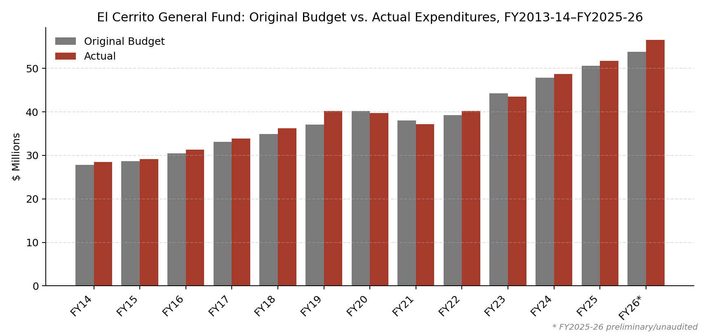
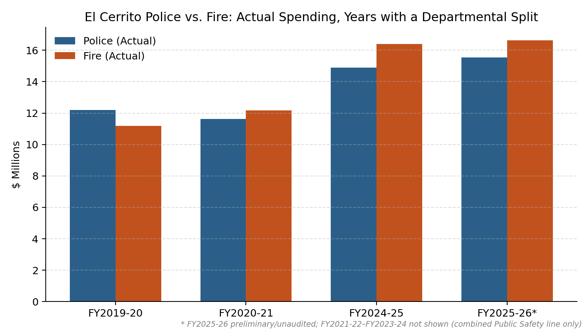

Source: each fiscal year's CAFR/ACFR General Fund Budgetary Comparison Schedule (Original / Final / Actual). FY2025-26 figures are preliminary/unaudited — final audit (ACFR) expected to Council December 2026.

## Revenue vs. Expenditure

## Annual Surplus / (Deficit)

FY2025-26 is a preliminary $1,083,711 deficit — the first deficit year since FY2018-19.

## Original Budget vs. Actual Expenditures

Actual expenditures exceeded the original adopted budget in 10 of the last 13 fiscal years. FY2025-26 has the largest gap in the series: actual spending ran $2,754,945 over the original adopted budget.

## FY2025-26 Fourth Quarter Update

| | Amount |
|---|---|
| Actual Revenue | $55,435,251 |
| Actual Expenditure | $56,518,962 |
| Deficit | $1,083,711 |

Source: City of El Cerrito FY2025-26 Q4 General Fund Budget Update (through 6/30/2026); Agenda Bill 8.A, September 15, 2026.

## Police vs. Fire: Actual Spending

A Police/Fire split exists only for FY2019-20, FY2020-21, and FY2024-25–FY2025-26 (budget-book basis for the latter two, not the ACFR schedule). Other years report a single combined "Public Safety" line.

