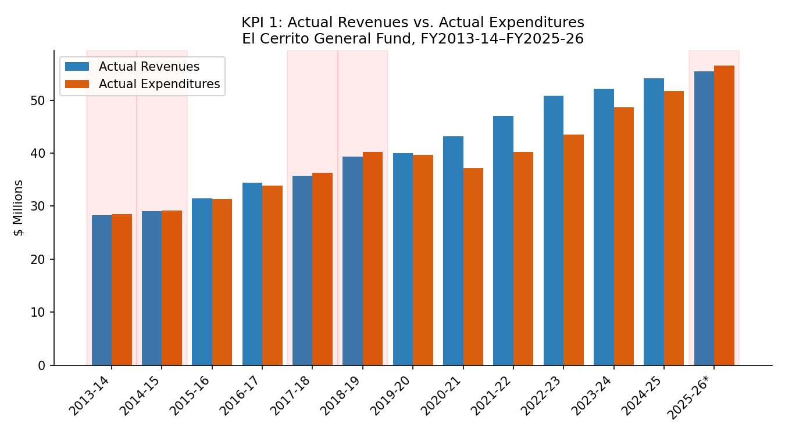
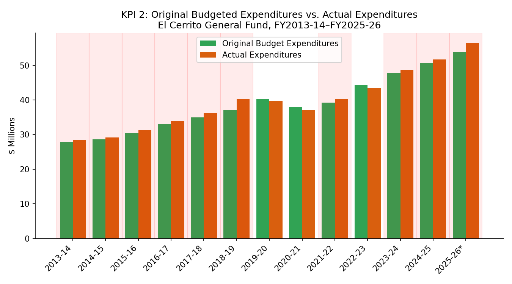
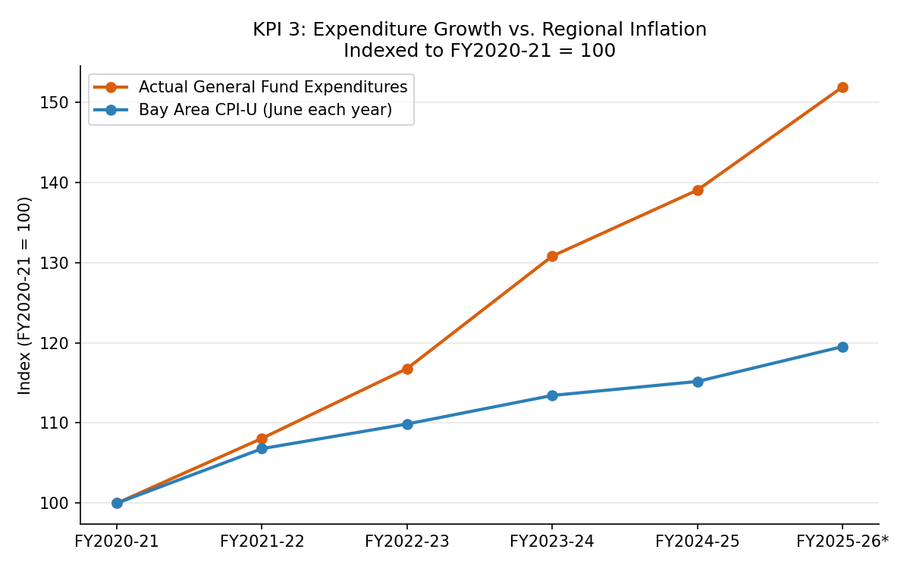

A three-indicator model that tests whether El Cerrito's General Fund is fiscally sustainable, using only the City's own audited financial statements and a regional inflation benchmark. Each indicator resolves to a pass/fail test against a published number, and every figure traces to a specific document and page.

For the underlying revenue/expenditure charts and the FY2025-26 Fourth Quarter update, see [Budget vs. Actual](budget-actual.html).

## The Model

| KPI | Test | What it measures |
|---|---|---|
| 1. Fiscal sustainability | Actual Revenues > Actual Expenditures | Is the General Fund living within its means in practice? |
| 2. Budget discipline | Original Budgeted Expenditures ≥ Actual Expenditures | Does the adopted budget hold, or does actual spending routinely outrun the plan the city started the year with? |
| 3. Real spending growth | Growth in Actual Expenditures ≤ regional CPI growth | Is spending growth outpacing inflation? |

Note on KPI 2: the benchmark is the *Original* (as-adopted) budget, not the *Final* (year-end amended) budget. Comparing Actual to Final is close to circular — cities routinely amend budgets upward mid-year to match emerging spending, so Actual will almost always track Final closely regardless of discipline. Comparing Actual to Original tests whether the plan the council adopted actually held.

## Scorecard

| Fiscal Year | KPI 1 (Revenue > Expenditure) | KPI 2 (Original Budget ≥ Actual) |
|---|:---:|:---:|
| FY 2013-14 | ✗ | ✗ |
| FY 2014-15 | ✗ | ✗ |
| FY 2015-16 | ✓ | ✗ |
| FY 2016-17 | ✓ | ✗ |
| FY 2017-18 | ✗ | ✗ |
| FY 2018-19 | ✗ | ✗ |
| FY 2019-20 | ✓ | ✓ |
| FY 2020-21 | ✓ | ✓ |
| FY 2021-22 | ✓ | ✗ |
| FY 2022-23 | ✓ | ✓ |
| FY 2023-24 | ✓ | ✗ |
| FY 2024-25 | ✓ | ✗ |
| FY 2025-26 (Prelim.) | ✗ | ✗ |

KPI 2 fails in 10 of the 13 years measured — Actual Expenditures have repeatedly exceeded the Original adopted budget, not just in the years before the State Auditor's report but across most of the study period, including several recent years that pass KPI 1.

## KPI 1: Revenue vs. Expenditure

The General Fund ran deficits (expenditures exceeding revenues) in FY2013-14, FY2014-15, FY2017-18, and FY2018-19 — the years leading up to the period covered by the State Auditor's fiscal-health review.

Revenues exceeded expenditures in every year from FY2019-20 through FY2024-25, including two years with unusually large surpluses — $6.0 million in FY2020-21 and $6.8 million in FY2021-22, well above the $0.6 million high seen in the prior surplus years (FY2015-16, FY2016-17).

The preliminary FY2025-26 figures show a return to deficit — Actual Expenditures exceeding Actual Revenues by roughly $1.1 million, the first deficit in this dataset since FY2018-19. This figure is unaudited and may be revised.

Source: City of El Cerrito ACFR/CAFR, General Fund Budgetary Comparison Schedules, FY2013-14–FY2024-25 (audited); FY2025-26 Q4 Budget Update & Agenda Bill 8.A, 9/15/2026 (unaudited).

## KPI 2: Original Budget vs. Actual Expenditures

Actual Expenditures exceeded the Original adopted budget in 10 of the 13 fiscal years measured — FY2013-14 through FY2018-19 without exception, then intermittently since (FY2021-22, FY2023-24, FY2024-25, and the preliminary FY2025-26). The two exceptions since FY2018-19, FY2019-20 and FY2020-21, are also the years with the largest KPI 1 surpluses.

### How the gap gets closed: mid-year amendments

The mechanism that keeps the Final (year-end amended) budget looking disciplined, even when the Original budget was not, is the mid-year amendment process:

| Fiscal Year | Original Budget Exp. | Final Budget Exp. | Increase |
|---|---:|---:|---:|
| FY 2023-24 | $47,852,822 | $51,369,923 | $3,517,101 |
| FY 2024-25 | $50,594,164 | $52,567,070 | $1,972,906 |
| FY 2025-26 (Prelim.) | $53,764,017 | $56,898,999 | $3,134,982 |
| 3-Year Average | | | $2,874,996 |

The budget is revised upward by an average of roughly $2.9 million between adoption and year-end in each of the last three fiscal years — which is why a KPI 2 test against the Final budget would pass in years where a test against the Original budget fails.

## KPI 3: Expenditure Growth vs. Inflation

Over the five-year period FY2020-21 to FY2025-26 (preliminary/unaudited):

| Measure | FY2020-21 | FY2025-26 | Total Change | CAGR |
|---|---:|---:|---:|---:|
| Actual General Fund Expenditures | $37,210,630 | $56,518,962 | +51.9% | +8.7%/yr |
| Bay Area CPI-U (June 2021 → June 2026) | 309.497 | 369.913 | +19.5% | +3.6%/yr |

General Fund expenditures grew at roughly 2.7 times the rate of regional inflation over this five-year window. The gap widens each year rather than closing.

Source: U.S. Bureau of Labor Statistics, CPI-U, All Items, San Francisco-Oakland-Hayward, CA (CBSA), series CUURA422SA0, via FRED, Federal Reserve Bank of St. Louis (data through August 2026, updated September 11, 2026).

## Notes

FY2025-26 figures throughout are preliminary and unaudited; the City's ACFR for that year is expected December 2026 and may revise these numbers. The FY2025-26 Final Budget Expenditure figure ($56,898,999) is $12,420 higher than Original Budget plus itemized amendments ($53,764,017 + $3,147,402 = $56,911,419) in the source documents; the source of this small gap was not identified during extraction. This model tests three narrow, specific indicators — it does not evaluate service levels, infrastructure condition, or capital planning.
