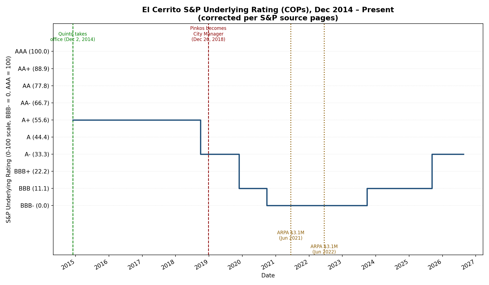

S&P Global Ratings' underlying rating (SPUR) on El Cerrito's certificates of participation (COPs) is the cleanest available measure of the city's general financial health, independent of any specific bond issuance.

| Date | Action | Rating |
|---|---|---|
| Dec 2, 2013 | Lowered (application of new local GO criteria) | AA− → A+ |
| Oct 1, 2018 | Lowered — weakened budgetary flexibility | A+ → A− |
| Nov 26, 2019 | Lowered two notches — deteriorating budgetary flexibility, second consecutive going-concern audit opinion | A− → BBB |
| Sept 24, 2020 | Lowered — negative general fund reserves, COVID-19 impact | BBB → BBB− |
| Sept 29, 2023 | Raised — resolution of going-concern opinions, restored structural balance | BBB− → BBB |
| Sept 9, 2025 | Raised — sustained structural balance, robust reserves | BBB → A− (current) |

::: {.source-note}
Source: S&P Global Ratings rating action publications, each dated as shown above. Ratings shown are the underlying rating (SPUR) on El Cerrito's certificates of participation (COPs). A related but separate instrument — El Cerrito Public Financing Authority sales tax revenue bonds — follows its own, similar rating track and reached A+ as of September 2025.
:::
