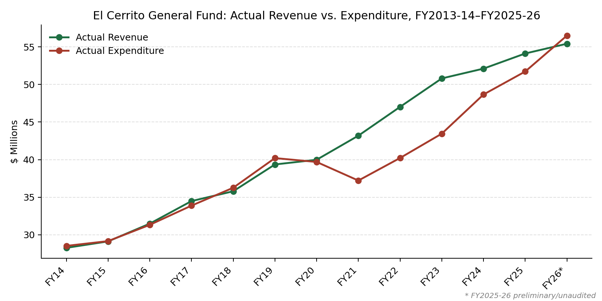

A sourced record of El Cerrito's financial condition, drawn directly from primary source documents: S&P Global Ratings publications, the City's audited annual financial reports (CAFRs/ACFRs), the California State Auditor, and the City's own financial records.

{width="80%" fig-align="center"}

## Pages

- [Budget KPI Model](budget-kpi-model.qmd) — A three-indicator scorecard testing revenue sustainability, budget discipline, and real spending growth against thirteen years of audited data
- [Budget vs. Actual](budget-actual.qmd) — General Fund revenue vs. expenditure, original budget vs. actual, and the FY2025-26 Fourth Quarter Update
- [Credit Rating History](credit-rating.qmd) — S&P's underlying rating (SPUR) on the City's certificates of participation, 2013–present
- [Going-Concern Audits](going-concern.qmd) — Every fiscal year the City's audited financial statements carried a going-concern designation, 2012–2025
- [State Auditor Report](state-auditor.qmd) — Findings from California State Auditor Report 2020-803
- [TRAN Borrowing](tran.qmd) — Annual short-term borrowing, FY2012–FY2022
- [Tax Collections](tax-collections.qmd) — Real Property Transfer Tax and other tax revenue
- [RDA Dissolution](rda-dissolution.qmd) — What the 2011–2012 state dissolution of redevelopment agencies cost El Cerrito

Each page reports documented facts without attributing responsibility to any individual.
