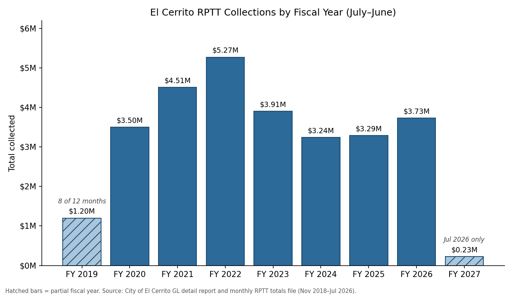

## Real Property Transfer Tax (Measure V)

Voters approved the Real Property Transfer Tax in November 2018 (Measure V). The tax took effect November 27, 2018, so FY2019 is a partial (8-month) first year, not a data gap. FY2026 is complete (Jul 2025–Jun 2026). FY2027 is the current, in-progress fiscal year; only July 2026 is available so far.

| Fiscal Year | Total Collected | Coverage |
|---|---|---|
| FY 2019 | $1,199,988.29 | Nov 2018–Jun 2019 (8 of 12 months — first, partial year) |
| FY 2020 | $3,500,304.01 | Complete |
| FY 2021 | $4,510,765.85 | Complete |
| FY 2022 | $5,271,864.00 | Complete |
| FY 2023 | $3,905,703.00 | Complete |
| FY 2024 | $3,238,272.00 | Complete |
| FY 2025 | $3,289,284.00 | Complete |
| FY 2026 | $3,732,276.00 | Complete |
| FY 2027 | $227,832.00 | Jul 2026 (1 of 12 months — in progress) |
| **Total, all months shown** | **$28,876,289.15** | Nov 2018–Jul 2026 |

::: {.source-note}
Source: City of El Cerrito Detail General Ledger Report, G/L Account 101-00-00-40710 (Nov 2018–Jun 2020, report run by Claire Coleman, Budget Director, 8/27/2026), and the City's monthly RPTT totals file (Jul 2020–Jul 2026). Fiscal year defined as July–June.
:::

## Other Tax Revenue

*Additional tax categories (property tax, sales tax, TOT, utility user tax) will be added here as data is confirmed.*
