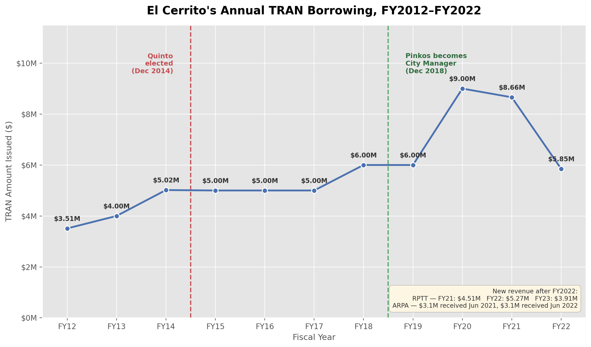

A Tax (and Revenue) Anticipation Note (TRAN) is short-term borrowing a city takes out to cover payroll and expenses before property tax revenue arrives. El Cerrito issued one every year for at least eleven consecutive years.

::: {.source-note}
Source: Notes to the City's audited financial statements (CAFRs/ACFRs) and City Council staff reports, each fiscal year. New revenue sources shown (Real Property Transfer Tax, ARPA funds) coincide with the TRAN's discontinuation after FY2022.
:::
