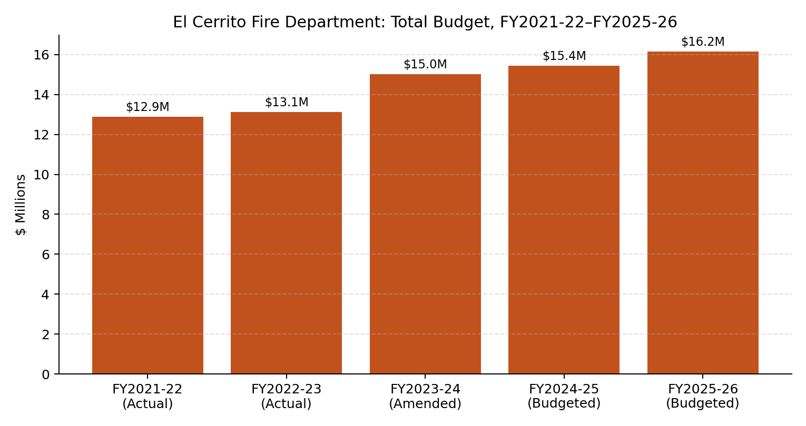

## Total Budget Trend

Source: FY2024-25/FY2025-26 Adopted Biennial Budget, pp.166–169 (General Fund + Vehicle/Equipment Replacement Internal Service Fund).

Personnel costs are approximately 89–90% of the Department's budget. A "Back Fill Costs" line — covering minimum staffing coverage during vacancies, leave, and injury — first appears in FY2024-25 ($955,000), rising to $1,087,000 in FY2025-26.

## FY2026-27 / FY2027-28 Adopted

| Fiscal Year | Adopted Budget |
|---|---|
| FY2026-27 | $17,339,840 |
| FY2027-28 | $17,911,556 |

Source: FY2026-27/FY2027-28 Proposed Biennial Budget, General Fund Expenditures by Department table, p.52. This is a General Fund department-level figure and is not directly comparable to the all-funds totals in the chart above.

## Kensington Fire Protection District Contract

Kensington reimburses El Cerrito for fire service under a contract in place since 1995. Contract revenue has grown from $3,716,920 (FY2021-22 actual) to $4,601,543 (FY2025-26 budgeted).

Source: FY2024-25/FY2025-26 Adopted Biennial Budget, p.169.
