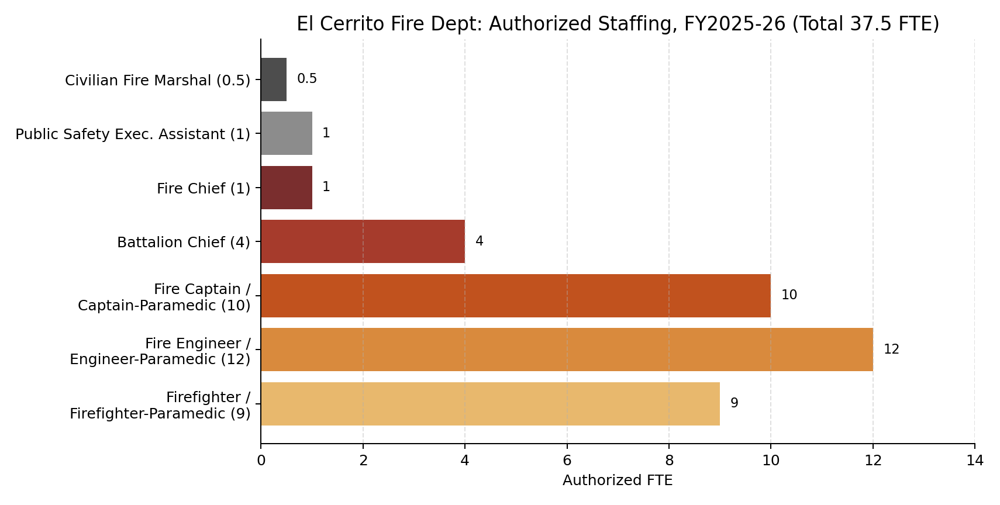

## Chain of Command

Fire Chief → Public Safety Executive Assistant / Battalion Chief (4) → Fire Captain / Captain-Paramedic (10) → Fire Engineer / Engineer-Paramedic (12) → Firefighter / Firefighter-Paramedic (9); Senior Program Manager / Civilian Fire Marshal (0.5) reports to the Fire Chief.

The Department is headed by a Fire Chief and four Battalion Chiefs: three shift Battalion Chiefs (A/B/C, covering Operations/EMS, Prevention, and Support Services) and one 40-hour Battalion Chief who heads the Training Division.

Source: FY2026-27/FY2027-28 Proposed Biennial Budget, p.148 (organization chart).

## Authorized Staffing, FY2025-26

Total authorized staffing is 37.5 FTE.

Source: FY2024-25/FY2025-26 Adopted Biennial Budget, p.159.

## Staffing History

Total authorized FTE has been stable: 37.0 from FY2019-20 through FY2022-23, rising to 37.5 in FY2023-24 with the addition of a 0.5 FTE Civilian Fire Marshal position. The distribution of ranks (Captain, Engineer, Firefighter classifications) has been reclassified over time to combine paramedic and non-paramedic sub-titles, but the underlying headcount by rank has not changed since FY2021-22.

Source: FY2023-24 Adopted Budget, p.157; FY2024-25/FY2025-26 Adopted Budget, p.159.
