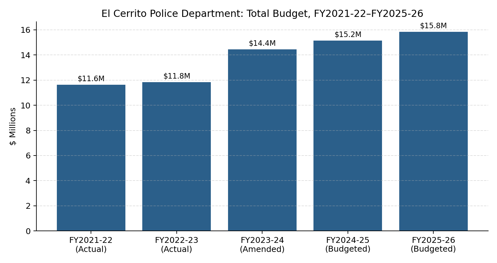

## Total Budget Trend

Source: FY2024-25/FY2025-26 Adopted Biennial Budget, pp.186-188 (General Fund + Asset Seizure + Vehicle Abatement + C.O.P.S. Grant funds).

Personnel costs are approximately 80-81% of the Department's budget. The budget includes a "Salary Savings" line — a budgeted vacancy offset — that swung from $0 (FY2021-22 through FY2023-24) to -$516,634 (FY2024-25 budgeted) and -$288,475 (FY2025-26 budgeted), reflecting an assumption that not all authorized positions will be filled.

## FY2026-27 / FY2027-28 Adopted

| Fiscal Year | Adopted Budget |
|---|---|
| FY2026-27 | $16,633,894 |
| FY2027-28 | $17,517,534 |

Source: FY2026-27/FY2027-28 Proposed Biennial Budget, General Fund Expenditures by Department table, p.52. This is a General Fund department-level figure and is not directly comparable to the all-funds totals in the chart above.
