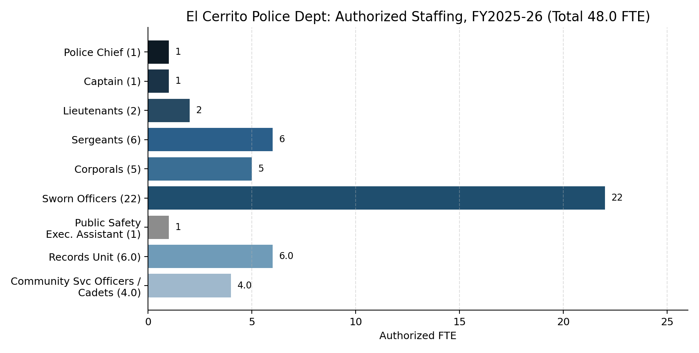

## Authorized Staffing, FY2025-26

Total authorized staffing is 48.0 FTE.

Source: FY2024-25/FY2025-26 Adopted Biennial Budget, p.178.

## Staffing History

Authorized staffing fell sharply during the FY2020-21/FY2021-22 restructuring — from 58.0 FTE (FY2019-20) to 48.0 FTE (FY2021-22) — and has held flat at 48.0 FTE every year since. The Council passed the FY2020-21 budget with the goal of permanent savings of $595,000, achieved by eliminating the Special Operations Division (and its Lieutenant position), eliminating one Sergeant position, and reallocating positions to Investigations. School Resource Officer positions (2) and Traffic Officer positions (3) were eliminated in this period; one Traffic Officer position was restored in FY2022-23 after citations issued fell 77% following the cut.

Source: FY2020-21 Adopted Budget, pp.112-113; FY2021-22 Adopted Budget, p.116; FY2024-25/FY2025-26 Adopted Budget, p.178.
